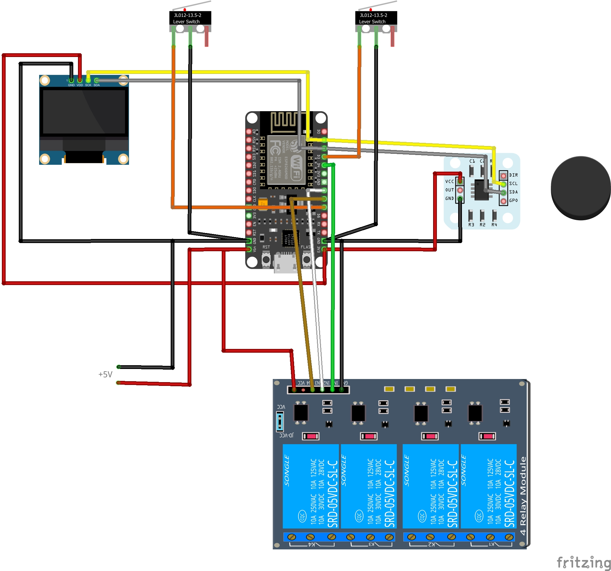

# Rotor DX Pro 📡

Advanced, open-source Antenna Rotator Controller based on the ESP8266 (NodeMCU) and the highly precise AS5600 absolute magnetic encoder. Designed for Ham Radio operators and DX hunters.

## ✨ Key Features
* **Absolute Precision:** Uses the AS5600 12-bit magnetic encoder instead of a traditional compass. Immune to local magnetic interference.
* **Smart Web UI (Responsive):** Control your antenna from a PC, tablet, or smartphone.
* **Built-in DXCC Database:** Select a country/region from a searchable dropdown, and the antenna automatically rotates to the correct azimuth.
* **Long Path (LP) Button:** Flip the target azimuth by exactly 180° with a single click.
* **3-Relay Power Management:** Separate relay for the main transformer power (PWR) to prevent overheating and RF interference, plus CW and CCW directional relays.
* **Shortest Path Logic:** The controller calculates the shortest rotational distance to the target without unwinding 360 degrees.
* **Hardware Limit Switches:** Full support for CW and CCW hardware limit switches for mechanical safety.
* **Zero-Calibration via Web:** Calibrate the North (0°) position with a single click in the browser. Saves permanently to EEPROM.
* **OLED Display:** Real-time azimuth, target, and WiFi status on a local 0.96" I2C OLED screen.

## 🛠️ Hardware Requirements
1. **Microcontroller:** ESP8266 (NodeMCU v3 or Wemos D1 Mini)
2. **Sensor:** AS5600 Magnetic Encoder + Diametrical Magnet (e.g., two 12x5x5mm neodymium magnets placed on a steel plate to form a magnetic yoke).
3. **Relays:** 3-Channel Relay Module (Main Power, Turn Right, Turn Left).
4. **Display:** SSD1306 0.96" OLED Display (I2C).
5. **Switches:** 2x Limit Switches (Normally Open/Closed - configured via pull-ups).
6. Antenna Rotor Engine & Main Transformer.

## ⚡ Pinout / Wiring
| Component | NodeMCU (ESP8266) Pin |
| :--- | :--- |
| **I2C SDA** (AS5600 + OLED) | `D2` (GPIO4) |
| **I2C SCL** (AS5600 + OLED) | `D1` (GPIO5) |
| **Relay: MAIN POWER** | `D4` (GPIO2) |
| **Relay: Turn CW (Right)** | `D5` (GPIO14) |
| **Relay: Turn CCW (Left)** | `D6` (GPIO12) |
| **Limit Switch: CW** | `D3` (GPIO0) - *Connect to GND* |
| **Limit Switch: CCW** | `D7` (GPIO13) - *Connect to GND* |

## 🚀 How to use
1. Enter your Wi-Fi credentials in the code (`ssid` and `password`).
2. Upload the code to your ESP8266 using the Arduino IDE.
3. Check the OLED display or Serial Monitor for the assigned IP address.
4. Open the IP address in your web browser.
5. Mechanically point your antenna to True North, then click **"USTAW OBECNĄ POZYCJĘ JAKO 0°"** on the Web UI to calibrate the AS5600 sensor.

## ⚠️ Notes on the AS5600 Magnet
To achieve a reading distance of up to 10-15 mm, do **not** use standard axial magnets. You must use a diametrically magnetized magnet. Alternatively, place two standard neodymium magnets (e.g., 10x5mm) side-by-side with a 2mm gap on a flat steel washer to create a strong magnetic arch directed at the sensor.

## ☕ Support the Project

If you find this project useful for your Ham Radio shack and it helped you catch some great DX, consider supporting my work! Your donations motivate me to keep improving the code and adding new features.

[**👉 Donate via PayPal (SQ6SFN)**](https://www.paypal.me/SQ6SFN)
